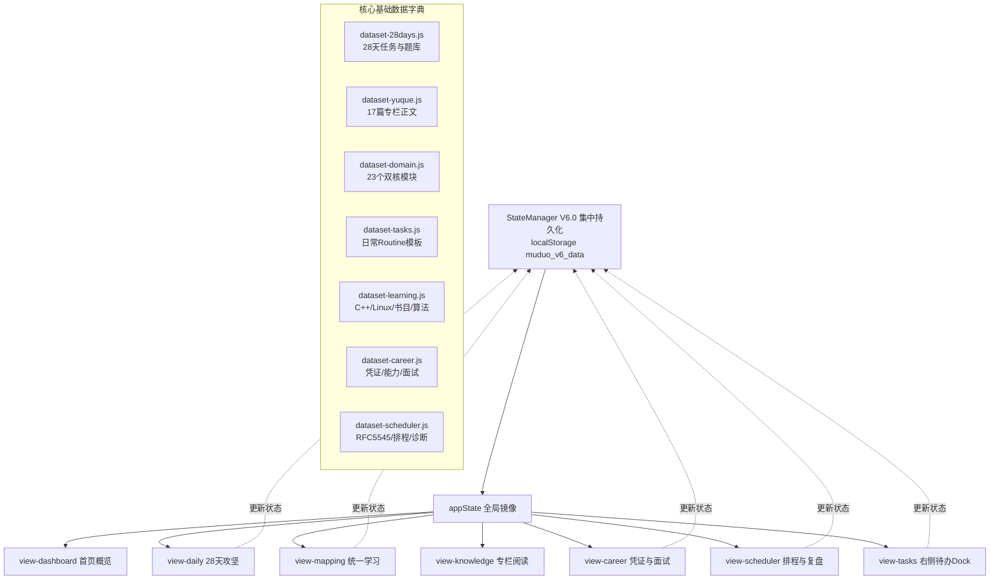

# V5 → V5.1 全面审查与架构收敛报告 (V5_CURRENT_AUDIT.md)

> **审计基准时间**: 2026-09-12  
> **项目定位纠偏**: 从口号式的“DUAL-CORE OS / 工业级训练平台”彻底回归到 **“CppAIService & muduo 个人工程学习工作台”**。  
> **核心原则**: 少功能 > 多功能；少页面 > 多页面；少装饰 > 多装饰；少形容词 > 多形容词；真实记录 > 自动生成；实际执行 > 数据展示。

---

## 一、当前页面结构审查

当前页面采用单页面应用 (SPA) 架构，通过 `index.html` 组织界面，主要结构分为四大区域：

```
[顶部通知 Toast (#toast)]
[顶部看板 Header]
  ├── 模式切换器 (#workspace-mode-switcher): 双核全景 / muduo 网络核心 / CppAIService 服务层
  ├── 顶部环境指引与拓扑直达按钮
  └── 7 维全局指标卡片 (muduo任务, CppAI专栏, Demo跑通, 八股自测, 踩坑闭环, 学习时长, 复习待办)
[主导航栏 (#view-tabs)] (9 个横向选项卡 + 1 个边栏开关)
[主内容区 <main>] (包含 9 个顶层视图 section，各占数百至近千行 HTML)
  ├── 1. 首页概览 (#view-dashboard) [860 行 HTML]
  │     ├── 28 天打卡热力方格 (#calendar-grid)
  │     ├── 学习时长统计与 Canvas 趋势折线图 (#study-chart-container)
  │     ├── 待复习列表卡片 (#review-due-list)
  │     ├── 巨幅 3 标签 SVG 架构拓扑大图 (#topology-card: 端到端 / muduo / CppAI)
  │     └── 3 张精力分级卡片 (精读验证 / 理解即可 / 暂不碰)
  ├── 2. 28 天任务与实验 (#view-daily)
  ├── 3. 统一学习体系 (#view-mapping) (内含 C++ / Linux / 书目 / 算法 / 八股 / 阅读 6 个子面板)
  ├── 4. 每日自测中心 (#view-quiz)
  ├── 5. muduo 源码路线 (#view-source) (8 阶源码瀑布流)
  ├── 6. C++ 踩坑档案 (#view-pitfalls) (检索与踩坑卡片)
  ├── 7. CppAIService 知识库 (#view-knowledge) (语雀 17 篇专栏阅读器 + 目录树 + 悬浮大纲)
  ├── 8. 求职能力与工程凭证 (#view-career) (凭据库 / 14维能力 / 7大面试模块 / 模拟面试 / STAR故事 5个子面板)
  └── 9. 智能排程与日历同步 (#view-scheduler) (时间轴 / 外部日历待办 / 根因诊断 / 每日复盘 4个子面板)
[右侧待办边栏 (#task-sidebar / #view-tasks)] (常规/紧凑模式切换 + 7 项日常 Routine 任务 + 番茄钟入口)
[全局模态框与抽屉] (多达 14 个 modal / drawer 容器，总计约 1,000 行 HTML)
```

---

## 二、当前功能清单

| 功能模块 | 所在视图 / 脚本 | 核心功能概述 |
| :--- | :--- | :--- |
| **顶部大盘指标** | Header / `app.js` | 显示 7 项统计指标（任务百分比、专栏阅读数、Demo 数、八股掌握度等） |
| **工作台模式切换** | Header / `app.js` | 过滤全景/muduo/CppAI 范围，联动今日推荐卡片 |
| **28天任务打卡** | `view-daily` / `dataset-28days.js` | Day 1~28 任务展示、打卡、知识点掌握度等级打分 (0~5) |
| **学习计时与时长追踪**| `timer.js` / `view-dashboard` | 番茄钟/自定义专注计时，生成 `studySessions`，绘制折线图 |
| **艾宾浩斯间隔复习** | `app.js` / `view-dashboard` | 自动推算 1/2/4/7/15 天复习周期，弹出 `#review-modal` |
| **三拓扑架构全景图** | `view-dashboard` / `index.html` | 内联 SVG 渲染请求链路、muduo 网络核心、CppAIService 架构；33 个节点支持弹出抽屉 |
| **统一学习体系** | `view-mapping` / `dataset-learning.js` | C++ 8 维、Linux 9 维、专业书伴读、算法 6 题、项目八股 4 题、通识 3 书 |
| **六维技术穿透透视** | `crosslink-modal` / `dataset-learning.js` | 弹窗展示 理论 ➔ 架构 ➔ 源码 ➔ 任务 ➔ 凭据 ➔ 面试 六层链条 |
| **每日深度自测** | `view-quiz` / `dataset-28days.js` | 28 天自测题库，选择题/简答题评分入库 |
| **8阶源码路线图** | `view-source` / `dataset-domain.js` | Channel 到 TimerQueue 演进时序，标记未读/研读中/已精读 |
| **踩坑档案库** | `view-pitfalls` / `dataset-28days.js` | 记录开发与调试中的典型 Bug，支持关键字检索与表单新增 |
| **语雀专栏阅读器** | `view-knowledge` / `yuque-explorer.js` | 17 篇专栏 Markdown 离线解析排版、目录树、目录大纲、收藏、已掌握 |
| **求职凭据与能力矩阵**| `view-career` / `dataset-career.js` | 9 类凭据管理、14 维能力自动评估、7 大面试全案、4-Hop 考题、模拟面试大厅、STAR 与简历素材 |
| **智能任务排程引擎** | `view-scheduler` / `dataset-scheduler.js` | RFC 5545 iCal 解析、Google Tasks 导入、冲突时隙合并、时间赤字压缩、心流编排、5大根因诊断、每日复盘报表生成 |
| **日常任务边栏 (Todo)**| `task-sidebar` / `dataset-tasks.js` | 7 项固定日常任务勾选、常规/紧凑模式免除、算法/书目/求职手记快捷录入 |
| **数据持久化与迁移** | `state-manager.js` | 集中状态管理、V5 到 V6 自动迁移、冷备份创建与救砖恢复、全量 JSON 导出与覆盖/合并导入 |

---

## 三、数据模型审查

系统当前在 `StateManagerClass` 中维护单一集中根状态树（存储在 `localStorage['muduo_v6_data']`），各数据切片如下：

```javascript
RootState {
  version: "6.0.0",
  lastModified: "2026-09-12T...",
  
  // 1. muduo 学习切片
  completedDays: [1, 2, ...],
  mastery: { [day]: { level, read, quizPassed, demo, independentImpl, sourceUnderstood, score } },
  reviews: { [day]: { stage, nextReviewDate, lastReviewDate, history: [] } },
  sourceStatus: { [nodeId]: { status, notes } },
  pitfalls: [ { id, title, type, symptom, rootCause, solution, codeSnippet } ],
  studySessions: [ { id, date, time, day, duration, type, note } ],
  dayNotes: { [day]: text },
  experimentNotes: { [day]: text },
  quizRecords: [ { id, day, timestamp, score, details } ],

  // 2. CppAIService 知识库切片
  knowledgeMastery: { [slug]: level },
  knowledgeFavorites: [ slug ],
  knowledgeRecent: [ slug ],

  // 3. 项目与工作台模式切片
  projectsProgress: {
    proj_muduo: { activeDay: 1, currentTrack: "l0_foundation", totalDays: 28 },
    proj_cppai: { activeArticle: "01_http_overview", currentTrack: "l3_protocol", totalArticles: 17 }
  },

  // 4. 日常任务切片 (Phase 4)
  dailyRoutine: {
    date: "YYYY-MM-DD",
    mode: "normal", // 'normal' | 'compact'
    tasks: [ { id, priority, category, title, estimatedMinutes, completed, completedAt } ],
    records: { algorithm: [], books: {}, careerNotes: "" },
    history: { [date]: { completedCount, totalCount, mode } }
  },

  // 5. 统一学习系统切片 (Phase 5)
  learningSystem: {
    algoReviewQueue: { [num]: 'due' | 'mastered' },
    qaMastery: { [qaId]: boolean },
    bookDynamicGoals: { linuxServer: 10, birdLinux: 10 },
    activeTab: 'cpp'
  },

  // 6. 求职凭据切片 (Phase 6)
  careerSystem: {
    evidences: [], // 预置真实凭证
    customEvidences: [], // 用户新增凭证
    mockInterviewLogs: [],
    bookmarkedQuestions: [],
    activeCareerTab: 'evidence'
  },

  // 7. 排程系统切片 (Phase 7)
  schedulerSystem: {
    calendarSource: { type, fileName, lastSyncTime, events: [] },
    googleTasks: [],
    dailySchedule: { date, availableMinutes, freeSlots, scheduledBlocks, deficitMinutes, compressionApplied },
    incompleteDiagnostics: { [taskId]: { reasonKey, note, suggestedAction } },
    dailyReviews: { [date]: { totalFocusedMinutes, completedCount, markdownReport } },
    activeSchedulerTab: 'planner'
  }
}
```

---

## 四、功能之间的依赖关系



**依赖紧密程度分析**：
1. `yuque-explorer.js` 仅依赖 `dataset-yuque.js` 与 `stateManager` 的知识库状态，高度内聚独立（**符合“语雀部分不需要修改”的要求**）。
2. `view-dashboard`（首页）严重过度依赖：同时拉取 `mastery`、`studySessions`、`reviews`、`topology`、28天日历、模式切换，代码体积庞大。
3. `view-tasks`（右侧边栏）与 `view-scheduler`（排程中心）存在**双头管理**：两者各自保存了一套今日待办与时间块状态，互相不通知，是数据不同步的主要根源。

---

## 五、重复功能详细盘查

系统经过多阶段增量叠加开发，累积了大量实质相同但界面各自独立的重复功能：

| 重复维度 | 表现位置 A | 表现位置 B | 表现位置 C | 冲突与浪费实质 |
| :--- | :--- | :--- | :--- | :--- |
| **今日任务** | 右侧边栏 `#view-tasks` | 排程中心 `#scheduler-pane-planner` | 首页推荐卡片 `#today-mission-recommendation` | 三处都在回答“今天做什么”，但数据项不同步、状态各自维护，用户需要在多处重复勾选。 |
| **项目学习与源码** | `view-knowledge` (专栏) | `view-source` (8阶路线) | `#topology-drawer` (拓扑抽屉) | 三处都在讲 EventLoop、Channel、Buffer，但路线图卡片、拓扑卡片与语雀文章各执一词，无法一站式串联。 |
| **Bug / 踩坑记录**| `view-pitfalls` (踩坑档案) | `view-career` (`troubleshooting_log` 凭证) | 遗留全局笔记 `notebook-textarea` | 同样的段错误/死锁问题，既能在踩坑档案写，又能在工程凭证写，造成记录分散碎片化。 |
| **八股自测** | `view-quiz` (28天自测) | `view-mapping` (项目驱动八股) | `view-career` (4-Hop 面试考点) | 3 个不同的做题判分区域，题目分类割裂，无法形成整体掌握度统计。 |
| **书目进度记录** | 右侧边栏 `#books-modal` | 统一学习体系伴读配额调整 | 排程中心书目任务块 | 用户只想记录“今天读了 10 页”，却要面对动态配额、模态框输入、打卡多道工序。 |
| **全局统计** | 顶部 7 个 Header 指标卡 | 首页工时折线图与 4 卡片 | 排程中心工时完成率统计 | 统计指标分散且维度重叠，缺乏直接指导行动的紧凑“本周概览”。 |

---

## 六、功能价值评估 (P0 / P1 / P2 / P3)

根据未来两个月“真实工程工作台（学习 ➔ 项目 ➔ 记录 ➔ 复习 ➔ 求职）”的核心定位，对现有功能进行价值分级：

### P0 级（核心刚需，每天必用，必须高保真保留并极简呈现）
1. **今日任务中心 (统一收敛)**：用户每天打开网站，一眼看清今天要做什么（预计耗时、具体项目任务、算法题、专业书页数、八股），支持完成打卡。
2. **CppAIService 项目推进与源码研读**：当前阶段、当前模块、当前任务进度，紧贴代码与专栏。
3. **真实工程日志 (新增关键功能)**：每天记录“今天做了什么、遇到什么问题、如何解决、学到什么、下一步做什么”，作为简历与面试的坚实底料。
4. **下一步行动提示机制 (新增关键功能)**：任务完成时引导填写“下一步做什么”，防止打卡即遗忘。
5. **muduo 28 天核心主干计划**：轻量进度卡片（当前天数、周主线、打卡状态）。

### P1 级（重要辅助，每周使用，移入专注二级页面，不抢占首页首屏）
1. **CppAIService 知识库 (语雀集成)**：17 篇高质量专栏研读，保持独立深度阅读体验。
2. **算法手撕 Lab (6 题 + 扩展)**：聚焦常见高频题、时空复杂度与二刷标记。
3. **项目核心八股自测**：围绕项目源码关键机制（eventfd、readv、FSM、MCP）的深度考点。
4. **工程凭据库 (结构化收敛)**：每条凭证标准化包含日期、项目、模块、问题、解决、代码路径与面试复述点。
5. **真实日历 / Google Tasks 汇总导入**：只承担简单的外部待办合并，不搞复杂玄学排程。
6. **艾宾浩斯间隔复习与技术复盘**。

### P2 级（低频功能，按需查看）
1. **项目模块架构地图**：由巨型 SVG 拓扑降级为清晰简洁的“模块层级树状图”，辅助查阅模块归属。
2. **精简能力矩阵**：从空泛的 14 维雷达图收敛为 8 维基于真实记录计算的实用进度。
3. **STAR 面试素材库**：面试准备阶段参考，平时不打扰。

### P3 级（低价值/冗余功能，建议立即删除或不予开发）
1. **遗留未使用的全局备忘录与模板代码** (`notebook-textarea`, `insertTemplate`)：直接删除。
2. **巨型 3-Tab SVG 架构拓扑大图 (硬编码近 700 行)**：降级移出首页。
3. **过度复杂的“时间赤字逐级压缩算法”文案与诊断引擎推演**：收敛为朴实的“时间不足时优先保证项目任务”。
4. **三张精力分级建议卡片**（“必须精读”、“理解即可”、“4周内不碰”）：内容静态，长期霸占首页空间，删除。
5. **AI 自动规划、复杂排程预测与浮夸评分模型**：一律不碰，保持纯粹工程纪律。

---

## 七、UI 层级与视觉负担问题

1. **首页首屏信息严重超载**：
   - 首页 (`view-dashboard`) 纵向高度超过 3,000 像素；
   - 用户打开首页无法立即聚焦今日行动，必须先滚动越过巨型 Header、7 个指标卡、28 天日历、工时折线图，才能看到零碎的信息；
   - 首页同时充斥着 SVG、Canvas、状态机、代码块，视觉焦点极其涣散。
2. **多重侧边栏与悬浮按钮冲突**：
   - 右侧常驻 410px 的 `#task-sidebar`；
   - 知识库页面又有独立右侧悬浮大纲目录；
   - 页面右下角有悬浮胶囊按钮 (`#task-sidebar-fab`)；
   - 多个层级的滚动条并存，导致宽屏与笔记本屏幕上的视口拥挤不堪。
3. **卡片嵌套卡片 (Card in Card 泛滥)**：
   - 大量元素外层包 `rounded-2xl`，内层包 `rounded-xl`，再内层包 `rounded-lg`；
   - 背景色堆叠了 `bg-white` ➔ `bg-stone-50` ➔ `bg-stone-100`，视觉杂乱且无效占用内边距 (Padding)。
4. **导航项多达 9 个**：
   - 在标准笔记本屏幕 (1366x768 / 1440x900) 下，主导航栏被挤爆，产生横向滚动条，极易产生迷失感。

---

## 八、文案问题审查 (Buzzwords & Marketing Tone)

项目中残留了大量产品宣传、公关包装式的夸大修饰词与无实际意义的英文装饰标题，严重背离了开发者的工程素养：

### 1. 必须立即清理的浮夸词汇
- `DUAL-CORE OS V6.0` ➔ 替换为 **`CppAIService & muduo 学习工作台`**
- `工业级训练平台` / `智能工程中枢` / `工程能力跃迁中心` ➔ 替换为 **`个人工程工作台`**
- `全链路能力中心` / `六维全链路穿透` ➔ 替换为 **`关联知识与面试点`**
- `4-Hop 逆向穿透` ➔ 替换为 **`面试溯源题`**
- `时间赤字逐级压缩` / `誓死保卫核心主干` ➔ 替换为 **`时间不足时优先保证项目任务`**
- `认知熔断保护` ➔ 替换为 **`休息或阅读`**
- `反应堆心脏` / `技术底座` ➔ 替换为 **`核心模块`**

### 2. 必须删除的无意义英文营销副标题
- `UNIFIED LEARNING SYSTEM`
- `CAREER EVIDENCE & CAPABILITY SYSTEM`
- `PERSONAL SCHEDULER & RFC 5545 CALENDAR SYNC`
- `SEQUENTIAL SOURCE CODE EXPLORATION`
- `KNOWLEDGE REPOSITORY 17 篇完整专栏 · 68,091 字精析`
- 这些标题没有任何功能属性，纯属视觉噪音。

---

## 九、可能存在的 Bug 审查

1. **父子容器未完全闭合的连锁风险**：
   - 之前在 `view-knowledge` 中遗漏 `</div></section>` 导致后续所有 section 被吞入导致全白屏的问题虽已紧急修复，但反映出 `index.html` 过于臃肿（2,900+ 行）缺乏模块化拆分保护。
2. **`appState` 与 `StateManager` 双写不同步 Bug**：
   - `persistState()` 试图将 `appState` 同步到 `muduo_v5_data`，而 `StateManagerClass` 又在异步写 `muduo_v6_data`；若用户在两个标签页操作或断网，容易出现某一状态被旧缓存覆盖。
3. **`notebook-textarea` 运行时空指针隐患**：
   - `app.js` 第 4020 行起有对 `notebook-textarea`、`notebook-status` 的取值与自动存盘操作，而 `index.html` 中根本不存在此元素，控制台若未加判空会静默失败或在特定事件分支抛出 ReferenceError。
4. **排程递归调用风险**：
   - `renderSchedulerPlanner()` 在未初始化数据时会调用 `runSmartScheduleCalculation(false)`，而后者尾部又无条件调用 `renderSchedulerPlanner()`。当前依靠分支逻辑退出，若排程为空数组时可能陷入无限递归栈溢出。
5. **Google Tasks JSON 导入字段容错**：
   - Google Takeout 导出的格式若缺少 `items` 数组或 `title` 字段缺失，目前 `GoogleTasksAdapter.parseJson` 对非标准结构容错较脆弱。

---

## 十、技术债 (Technical Debt)

1. **`app.js` 严重单体化 (Monolithic Hell)**：
   - 单文件高达 6,448 行代码，混合了数据访问层、业务规则层、视图渲染层与工具函数；
   - 许多模块本应像 `timer.js` 或 `yuque-explorer.js` 一样独立为独立文件（如 `career.js`, `scheduler.js`, `dashboard.js`）。
2. **`classic.html` 沉重包袱**：
   - `classic.html` 达到 7,713 行、467 KB，是最初未拆分时的单一庞然大物。虽然已作为归档，但仍存留在根目录并在 `build_static.cjs` 中随包分发，容易引起维护混淆。
3. **全局作用域过度暴露**：
   - `app.js` 尾部挂载了超过 100 个函数到 `window` 和 `globalThis`；
   - 任何拼写错误或全局覆盖都可能引发难以定位的静默 Bug。
4. **SVG 图纸硬编码**：
   - 拓扑图直接手写内联了近 700 行具有精确像素坐标 (`x=250`, `y=120`, `path d="..."`) 的 SVG 代码，极难维护和响应式适配。

---

## 十一、建议删除的内容

1. **删除遗留笔记死代码**：
   - `app.js` 中的 `notebook-textarea`、`saveGlobalNotesManual`、`clearGlobalNotes`、`insertTemplate` 及其相关模板字符串。
2. **删除首页 3 张静态精力分级卡片**：
   - “必须精读、动手写 Demo 验证”、“理解即可，不必陷入语法深渊”、“4周内绝对不碰，节省精力”。
3. **删除重复的“微型验证 Demo、指针踩坑与源码思考备忘录”**：
   - 彻底并入“工程日志”与“真实工程凭证”。
4. **删除主导航与各视图中的浮夸英文装饰标题**：
   - 移除全部全大写英文字符条与宣传性副标。
5. **删除重复的今日任务排程多头展现**：
   - 彻底废除“边栏一套任务、排程页一套时间块、首页又有一张卡片”的分裂模式。

---

## 十二、建议保留的内容

1. **语雀专栏阅读系统 (`docs/yuque/` + `yuque-explorer.js`)**：
   - 17 篇高质量专栏内容是整个系统的理论基础，必须 100% 保留且不修改其内容与阅读器稳定性。
2. **28 天 muduo 核心任务与题库 (`dataset-28days.js`)**：
   - 底层网络库的基础学习骨架，保持数据完整。
3. **工程凭据模型 (`dataset-career.js`)**：
   - 9 类凭据定义与真实的 Git Commit / 测试 / 压测基准数据，这是未来面试求职的生命线。
4. **RFC 5545 iCal / Google Tasks 原生解析能力 (`dataset-scheduler.js`)**：
   - 真实对接外部日程与待办的能力极其珍贵，保留核心解析器，去除外层花哨包装。
5. **StateManager V6 架构与冷备份机制 (`state-manager.js`)**：
   - 保护用户历史学习数据的绝对基石。
6. **番茄钟专注计时器 (`timer.js`)**。

---

## 十三、建议延后的内容 (P3 级)

1. **复杂 AI 自动排程与自适应工时机器学习预测**：不要在当前阶段投入精力。
2. **三维/复杂 Canvas 动态力导向拓扑图**：维持静态清晰展示，不搞酷炫物理引擎。
3. **复杂全自动社交分享/生成图片海报**：非学习核心，坚决延后。
4. **多端云端实时 WebSocket 同步**：先基于 localStorage + JSON 本地导入导出，保证纯静态无服务端秒开。

---

## 十四、建议新增的内容 (V5.1 核心价值增量)

### 1. 真实工程工作日志 (Engineering Work Log)
- **定位**：每天学习与写代码后的唯一官方出口。
- **每日固定 5 问**：
  1. 今天做了什么？
  2. 遇到什么问题？
  3. 怎么解决？
  4. 学到了什么？
  5. 下一步做什么？
- **自动联动**：勾选今日任务时可快捷附带手记并沉淀到日志库；日志支持生成 Markdown 汇总，直接用于周复盘与简历素材。

### 2. “下一步行动”引导机制 (Next-Action Driver)
- 每个项目任务完成打卡后，强制/推荐记录“下一步要做什么”，次日打开页面自动提取作为首要行动提示，彻底解决“打卡完成 = 学习断层”的弊端。

### 3. 项目模块层级地图 (Module Hierarchy Map)
- 替代庞大沉重的 SVG 架构图。
- 采用极简的树状/列表卡片，直观展现 CppAIService 的结构：
  - `HTTP` (HttpContext, HttpRequest, HttpResponse, Router)
  - `MCP` (Registry, Tool, Call)
  - `AI` (Model, Agent, Service)
  - `Message` (RabbitMQ)
- 每个模块直接挂载：源码路径、学习任务、关联知识、Demo、面试考点。

### 4. 极致收敛的“五合一”纯净首页
首页只保留 5 个核心区域，严格控制在 1~2 屏之内：
1. **今日任务 (最核心)**：清晰列出今日任务清单与预计工时，直面执行。
2. **项目进度**：CppAIService 当前阶段、当前模块、当前任务、最近代码修改。
3. **muduo 学习进度**：Day 进度与当前周重点。
4. **最近记录 (5 条真实日志)**：真实展现最近攻坚的工程实绩。
5. **本周统计**：精简数据汇总（学习时长、项目用时、算法题量、完成任务、代码记录）。

---

## 十五、总结与下一步实施建议

当前项目代码库蕴藏着扎实详尽的 C++、Linux、muduo 与 CppAIService 深度内容，但被过去多个增量阶段引入的“功能重复、信息过载、文案浮夸、多头管理”所遮蔽。

接下来的 **V5.1 重构优化** 将坚定贯彻：
- **第一步**：基于本审查报告制定《V5.1 信息架构与数据模型设计说明书》（`V5.1_INFORMATION_ARCHITECTURE.md`）；
- **第二步**：实施首页精简与信息降噪，收敛今日任务单一源头，剔除死代码与营销文案；
- **第三步**：上线“工程日志”、“下一步行动”与“项目模块地图”；
- **第四步**：通过全量自动化回归测试，确保语雀内容毫发无损，历史打卡数据 100% 完整迁移。
