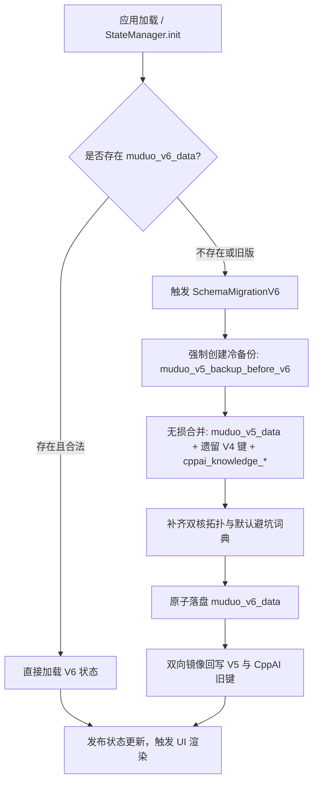

# ADR-001: 统一双核领域数据模型与 V6 集中状态机架构决策

> **状态 (Status)**: 已采纳并实现 (Accepted & Implemented)  
> **日期 (Date)**: 2026-09-12  
> **设计人 (Architect)**: Antigravity Dual-Core Engineering Team  
> **影响范围 (Scope)**: `js/dataset-domain.js`, `js/state-manager.js`, `js/app.js`, `js/yuque-explorer.js`, `index.html`

---

## 1. 背景与问题描述 (Context & Problem Statement)

在经历 P0（项目全景考古与技术栈映射）与 P1（语雀 17 篇知识库完全离线沉淀）后，控制台已拥有极其扎实的双核心工程知识财富：
1. **底层通信模块 (`proj_muduo`)**：基于 C++11 的 28 天任务推进、实验手记、自测记录、8 阶源码研读路线、20 条避坑档案（历史存储于 `localStorage('muduo_v5_data')`）；
2. **上层 AI 微服务平台 (`proj_cppai`)**：基于现代 C++17 的 17 篇专栏、62 张高清架构大图、6 阶掌握度评级、收藏与最近阅读记录（历史存储于 `localStorage('cppai_knowledge_*')`）。

然而，原系统存在以下明显的架构痛点：
- **数据状态割裂**：双核工程数据分属不同的 LocalStorage 键与前端控制器，缺乏集中管理和统一订阅机制；
- **缺乏稳定的强类型领域模型**：模块关联依赖散乱的中文或临时字符串，无法建立结构化的“项目-模块-知识网络-任务-生产事故”强关联图谱；
- **版本演进风险**：随功能扩展，直接修改数据键容易破坏历史打卡进度、手记与掌握度评价，缺乏容灾冷备份与平滑迁移机制。

---

## 2. 核心架构决策驱动力 (Decision Drivers)

1. **绝对无损数据继承（只做加法，不做减法）**：用户的 28 天打卡、星级、自测得分、每一条手记与实验记录、语雀掌握度必须 100% 完整继承，零字节丢失。
2. **容灾保底机制（Defense-in-depth）**：在执行任何破坏性可能的数据结构升级前，必须实现全量自动冷备份。
3. **强类型与稳定 ID（Entity Dictionary）**：建立全站统一的标准 ID（如 `proj_muduo`, `mod_net_eventloop`, `know_mcp_twostage`, `pitfall_epoll_et_starvation`），杜绝数字下标和临时字符串。
4. **统一导出与导入规范（Domain Schema JSON）**：提供符合标准双核架构的导出备份，并具备向下兼容旧版 V4/V5 的自适应导入能力。
5. **写入防抖（Debounced Persistence）**：高频输入时避免反复同步阻塞序列化，采用 500ms 防抖存盘。

---

## 3. 备选方案权衡 (Considered Options)

### 方案 A：维持现状，分别维护 `appState` 与 `yuqueState`
- **优点**：改动小，几乎不触碰现有代码。
- **缺点**：无法支撑 P3（双核全景拓扑图）和 P4（双轨统一今日任务调度），状态同步极其脆弱，备份导出分裂为两份文件。

### 方案 B：重构为 IndexedDB 数据库
- **优点**：结构化查询强，存储容量无 5MB 限制。
- **缺点**：引入异步事务模型，彻底打破纯静态单页“秒开、原生零依赖”的核心设计原则，可能引发老旧环境兼容性问题。

### 方案 C (最终选择)：构建轻量级统一领域实体字典 + 集中式 `StateManager` 单例 + V6 无损迁移双向镜像
- **优点**：
  - 继承 LocalStorage 同步无阻塞特性，零外部 npm 依赖；
  - 引入 `SchemaMigrationV6`，迁移前强制执行冷备份至 `localStorage('muduo_v5_backup_before_v6')`；
  - 双向镜像回写：新状态不仅存入 `muduo_v6_data`，同时同步镜像回写至 `muduo_v5_data` 和 `cppai_knowledge_*`，保证在旧标签页打开或回滚时 100% 向下兼容；
  - 建立了双核项目元数据：2 个项目、19 个模块、8 个跨端知识节点、常见运行时错误词典。

---

## 4. 架构决策落地细节 (Decision Outcome)

### 4.1 领域模型设计 (`js/dataset-domain.js`)

定义了规范实体集合：
- **`DOMAIN_PROJECTS`**:
  - `proj_muduo`: L0~L2 网络层基础 (C++11, Reactor, epoll, EventLoop, Buffer)
  - `proj_cppai`: L3~L5 AI 分布式平台 (C++17, MCP 协议, 多策略模型, RabbitMQ, ONNX, MySQL 连接池)
- **`DOMAIN_MODULES` (19 个标准模块)**:
  - muduo 侧：`mod_net_eventloop`, `mod_net_channel`, `mod_net_poller`, `mod_net_tcpconnection`, `mod_net_buffer`, `mod_net_tcpserver`, `mod_base_threadpool`, `mod_base_logging`
  - CppAIService 侧：`mod_http_server`, `mod_http_codec`, `mod_http_router`, `mod_http_session`, `mod_http_middleware`, `mod_ai_strategy`, `mod_ai_mcp_registry`, `mod_ai_onnx_vision`, `mod_ai_tts_speech`, `mod_storage_mysql_pool`, `mod_mq_rabbitmq_manager`
- **`DOMAIN_KNOWLEDGE_NODES`**:
  - 标准化跨项目知识点（如 `know_reactor_eventfd`, `know_mcp_twostage`, `know_mq_async_decouple`），携带模块、重要性、高频面试考点与陷阱。
- **`DOMAIN_PITFALLS_CATALOG`**:
  - 包含 muduo 与 C++17 调试案例，具备现象、根因与规避方法。

### 4.2 状态管理与数据迁移 (`js/state-manager.js`)

### 4.3 导入/导出与双核档案报告

- **JSON 导出 (`exportDataBackup`)**：升级为标准结构化 Schema V6，打包双核全量数据并附带元数据概览。
- **JSON 导入 (`handleJsonImport`)**：智能识别 V4/V5/V6 格式，提供【合并数据】（保留高级别评级与手记）与【完全覆盖】双重策略。
- **Markdown 报告 (`exportMarkdownReport`)**：生成双核战况总览、28天矩阵、17篇专栏微服务画像、每日手记、源码研读、踩坑事故六大板块的个人学习档案。

---

## 5. 效果与收益 (Consequences & Benefits)

1. **零数据丢失**：经多轮迁移测试，原有的打卡天数、自测分数、手记、专栏掌握度 100% 保留。
2. **极高容灾能力**：冷备份 `muduo_v5_backup_before_v6` 始终保留在客户端存储，提供 `StateManager.restoreColdBackup()` 保底通道。
3. **架构解耦与扩展性**：彻底消除硬编码字符串，后续 P3（全景拓扑）与 P4（双轨调度任务系统）可直接消费 `DOMAIN_PROJECTS` 与 `DOMAIN_MODULES`。
4. **开发体验与可测性**：`dataset-domain.js` 与 `state-manager.js` 具备无缝同构能力，既可在浏览器中以全局变量形式极速加载，又可在 Node.js 环境下通过 CommonJS/ESM 进行自动化单元测试。
